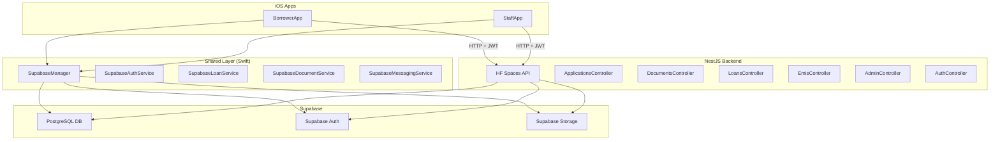
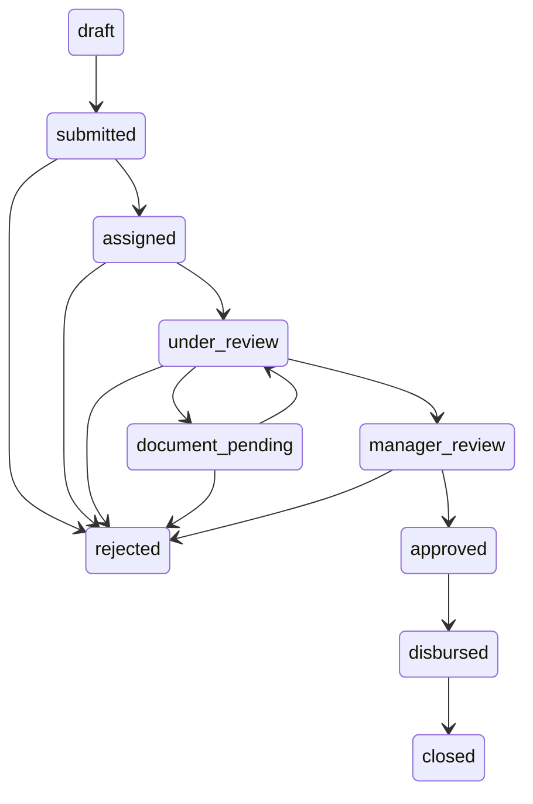

# LMS Project — Complete Context Map

## Project Overview

A **Loan Management System** with:
- **2 iOS app targets** (BorrowerApp, StaffApp) in a single Xcode workspace (`LMS.xcodeproj`)
- **1 NestJS backend** (`lms-backend/`) deployed on HuggingFace Spaces
- **Supabase** as the database, auth, and storage layer

> [!IMPORTANT]
> **Backend API Base URL:** `https://arshitsinghal-lms-backend.hf.space`
> All NestJS API routes are prefixed under this host (no `/api` prefix in controller routes — NestJS routes are at root, e.g. `/applications`, `/documents`).
> Swagger docs are mounted at `/api` (see `main.ts` L33).

> [!IMPORTANT]
> **Supabase Project:**
> - URL: `https://kezcsrprvhzysftopjqd.supabase.co`
> - Publishable key: `sb_publishable_kVi_Wh86_lesAuTm6f7kxw_8xshrFgQ`
> - Email OTP: 6 digits, 120s expiry
> - Email confirmation: **Enabled**
> - Password requirements: Lowercase + Uppercase + Digits + Symbols, minimum 8 chars

---

## Architecture Diagram



---

## 1. iOS Apps

### Project Structure

```
LMS/
├── LMS.xcodeproj
├── BorrowerApp/
│   ├── App/
│   │   └── BorrowerApp.swift          ← @main entry point
│   ├── Views/
│   │   ├── LoginView.swift            ← Email/password login + OTP verification
│   │   ├── RegisterView.swift         ← Sign up → navigates to OTP
│   │   ├── ForgotPasswordView.swift
│   │   ├── HomeDashboardView.swift    ← Main dashboard after login
│   │   ├── NewLoanApplicationView.swift ← Loan application form
│   │   ├── ApplicationTrackingView.swift
│   │   ├── KYCView.swift              ← Document upload for KYC
│   │   ├── RepaymentDashboardView.swift
│   │   ├── BorrowerProfileView.swift
│   │   ├── BorrowerMessagingView.swift
│   │   ├── NotificationsView.swift
│   │   ├── EMICalculatorView.swift
│   │   └── ContentView.swift          ← (Supabase demo, todos)
│   ├── ViewModels/
│   │   ├── AuthViewModel.swift        ← signIn, signUp, verifyEmailOTP
│   │   ├── LoanApplicationViewModel.swift ← loadProducts, submit
│   │   ├── DashboardViewModel.swift
│   │   ├── RepaymentViewModel.swift
│   │   └── MessagingViewModel.swift
│   └── Resources/
├── StaffApp/
│   ├── App/
│   │   └── StaffApp.swift             ← @main entry point
│   └── Views/
│       ├── StaffLoginView.swift
│       ├── TwoFactorAuthView.swift.swift
│       ├── RoleTabViews.swift
│       ├── StaffProfileView.swift
│       ├── ReportsView.swift
│       ├── LoanOfficer/              ← Officer-specific views
│       ├── Manager/                   ← Manager-specific views
│       └── Admin/                     ← Admin-specific views
├── Shared/
│   ├── Models.swift                   ← ALL domain models (User, LoanApplication, Loan, EMI, etc.)
│   ├── AppEnvironment.swift           ← DI container via @Environment
│   ├── SessionStore.swift             ← @Observable session state (currentUser, profiles)
│   ├── DesignSystem/                  ← Colors, Typography, Spacing, PrimaryButton, etc.
│   ├── Utilities/                     ← EMICalculator, Formatting, Validators
│   ├── Networking/
│   │   ├── APIClient.swift            ← Protocol + APIRequest/APIError types
│   │   └── Endpoints.swift            ← Route path constants
│   └── Services/
│       ├── AuthService.swift          ← Protocol
│       ├── LoanService.swift          ← Protocol
│       ├── DocumentService.swift      ← Protocol
│       ├── MessagingService.swift     ← Protocol
│       ├── NotificationService.swift  ← Protocol
│       ├── KeychainService.swift      ← Protocol
│       ├── AdminService.swift         ← Protocol
│       ├── Supabase/
│       │   ├── SupabaseManager.swift  ← Singleton SupabaseClient + custom decoder
│       │   ├── SupabaseAuthService.swift
│       │   ├── SupabaseLoanService.swift
│       │   ├── SupabaseDocumentService.swift
│       │   └── SupabaseMessagingService.swift
│       └── Mocks/
│           ├── MockAuthService.swift
│           ├── MockLoanService.swift
│           └── MockSupportServices.swift
└── lms-backend/                       ← NestJS API
```

### Service Protocol Summary

| Protocol | Methods |
|---|---|
| `AuthService` | `signIn(email:password:)`, `signUp(email:password:fullName:phone:)`, `verifyEmailOTP(email:code:)`, `requestOTP(identifier:)`, `verifyOTP(identifier:code:)`, `signInWithPasskey()`, `signOut()`, `currentUser` |
| `LoanService` | `fetchLoanProducts()`, `createApplication(productID:requestedAmount:tenureMonths:)`, `submitApplication(id:)`, `fetchApplications(for:)`, `fetchAssignedApplications(officerID:)`, `updateStatus(applicationID:to:note:)`, `fetchActiveLoans(borrowerID:)`, `fetchEMISchedule(loanID:)` |
| `DocumentService` | `upload(_:fileName:mimeType:kind:ownerID:)`, `list(ownerID:)`, `delete(documentID:)`, `updateStatus(documentID:status:)` |
| `MessagingService` | `threads(for:)`, `messages(threadID:)`, `send(_:)`, `markRead(threadID:upTo:)` |

### Dependency Injection

[BorrowerApp.swift](file:///Users/arshitsinghal/Documents/GitHub/LMS/BorrowerApp/App/BorrowerApp.swift) injects services via `AppEnvironment`:
```swift
AppEnvironment(
    auth: SupabaseAuthService(),
    loans: SupabaseLoanService(client: SupabaseManager.shared.client),
    documents: SupabaseDocumentService(client: SupabaseManager.shared.client),
    notifications: MockNotificationService(),  // still mock
    messaging: SupabaseMessagingService(client: SupabaseManager.shared.client),
    keychain: MockKeychainService()             // still mock
)
```

### Key Data Flow

1. **Login**: `LoginView` → `AuthViewModel.signIn()` → `SupabaseAuthService.signIn()` → `supabase.auth.signIn(email:password:)` → sets `SessionStore.currentUser`
2. **Register**: `RegisterView` → `AuthViewModel.signUp()` → `SupabaseAuthService.signUp()` → navigates to `OTPVerificationView` → `verifyEmailOTP()` → `supabase.auth.verifyOTP(email:token:type:.signup)`
3. **Apply for Loan**: `NewLoanApplicationView` → `LoanApplicationViewModel.submit()` → `SupabaseLoanService.createApplication()` → **calls NestJS API `POST /applications`** (NOT direct Supabase insert)
4. **Upload Document**: `KYCView` → `SupabaseDocumentService.upload()` → uploads to Supabase Storage bucket `documents` → inserts row in `loan_documents` table

---

## 2. NestJS Backend

### Base URL & Deployment
- **Host**: `https://arshitsinghal-lms-backend.hf.space`
- **Deployed via**: Docker on HuggingFace Spaces (port 7860)
- **Swagger**: Mounted at `/api` (browsable docs)
- **Auth**: All controllers use `JwtAuthGuard` which validates Supabase JWT tokens against JWKS endpoint, then looks up user in `users` table
- **Supabase client**: Uses `service_role` key (admin access, bypasses RLS)

### API Routes

| Method | Route | Controller | Role Guard | Description |
|---|---|---|---|---|
| **Auth** |
| `GET` | `/auth/me` | AuthController | JWT | Get current user profile from `users` table |
| **Applications** |
| `GET` | `/applications/my` | ApplicationsController | borrower | Get borrower's own applications |
| `GET` | `/applications/assigned` | ApplicationsController | loan_officer | Get officer's assigned applications |
| `GET` | `/applications/:id` | ApplicationsController | any authed | Get application details |
| `GET` | `/applications/:id/events` | ApplicationsController | any authed | Get application event timeline |
| `POST` | `/applications` | ApplicationsController | borrower | **Create new application** (auto-assigns officer, logs events) |
| `POST` | `/applications/:id/start-review` | ApplicationsController | loan_officer | Start review of assigned app |
| `POST` | `/applications/:id/request-documents` | ApplicationsController | loan_officer | Request additional docs |
| `POST` | `/applications/:id/documents-uploaded` | ApplicationsController | borrower | Notify docs uploaded |
| `POST` | `/applications/:id/send-to-manager` | ApplicationsController | loan_officer | Escalate to manager |
| `POST` | `/applications/:id/approve` | ApplicationsController | manager, admin | Approve application |
| `POST` | `/applications/:id/reject` | ApplicationsController | loan_officer, manager, admin | Reject application |
| **Documents** |
| `POST` | `/documents/upload` | DocumentsController | borrower | Upload document (multipart/form-data, field: `file` + `kind`) |
| `GET` | `/documents/:id/url` | DocumentsController | any authed | Get signed URL for document |
| `POST` | `/documents/:id/verify` | DocumentsController | loan_officer, manager, admin | Verify document |
| `POST` | `/documents/:id/reject` | DocumentsController | loan_officer, manager, admin | Reject document |
| **Loans** |
| `POST` | `/loans/applications/:id/disburse` | LoansController | manager, admin | Disburse approved loan (creates loan + EMI schedule) |
| **EMIs** |
| `POST` | `/emis/:id/pay` | EmisController | borrower, admin | Pay an EMI |
| **Admin** |
| `POST` | `/admin/staff` | AdminController | admin | Create staff user (creates auth user + updates `users` + creates `staff_profiles`) |

### Application Workflow State Machine



> [!NOTE]
> When `POST /applications` is called, the backend auto-assigns a loan officer and sets status to `assigned` (not `submitted`).

### Document Upload Flow (Backend)
1. Validates file type (pdf, jpeg, png) and size (max 10MB)
2. Uploads to Supabase Storage bucket: **`loan_documents`**
3. Inserts metadata row in DB table: **`loan_documents`**
4. `remote_url` stores the **storage path** (e.g. `{ownerId}/{uuid}.pdf`), NOT a full URL

### Create Application DTO
```typescript
{
  loanProductId: string;  // UUID
  requestedAmount: number;
  tenureMonths: number;
}
```

### Upload Document DTO
- Multipart form-data: `file` (binary) + `kind` (string enum: `identityProof | addressProof | incomeProof | bankStatement | collateral | other`)

---

## 3. Supabase Database Tables

Inferred from backend and iOS code:

| Table | Key Columns | Notes |
|---|---|---|
| `users` | `id`, `email`, `role`, `full_name`, `phone`, `is_active`, `must_change_password`, `mfa_required` | Synced with Supabase Auth. Roles: `borrower`, `loan_officer`, `manager`, `admin` |
| `staff_profiles` | `id`, `employee_id`, `department`, `reports_to_id` | FK to `users.id` |
| `loan_products` | `id`, `name`, `description`, `minimum_amount`, `maximum_amount`, `minimum_tenure_months`, `maximum_tenure_months`, `minimum_interest_rate`, `maximum_interest_rate`, `is_active` | |
| `loan_applications` | `id`, `borrower_id`, `assigned_officer_id`, `loan_product_id`, `requested_amount`, `tenure_months`, `interest_rate`, `status`, `created_at`, `updated_at` | Status values: `draft`, `submitted`, `assigned`, `under_review`, `document_pending`, `manager_review`, `approved`, `rejected`, `disbursed`, `closed` |
| `loan_application_events` | `id`, `application_id`, `actor_id`, `event_type`, `remark`, `metadata`, `from_status`, `to_status`, `created_at` | Audit trail for application workflow |
| `loan_application_documents` | `application_id`, `document_id` | Junction table linking applications to documents |
| `loan_documents` | `id`, `owner_id`, `kind`, `file_name`, `remote_url`, `status`, `uploaded_at` | Status: `pending`, `verified`, `rejected`. `remote_url` = storage path |
| `loans` | `id`, `application_id`, `borrower_id`, `principal`, `interest_rate`, `tenure_months`, `disbursement_date`, `outstanding_balance`, `status` | Status: `active`, `closed`, `defaulted` |
| `emis` | `id`, `loan_id`, `installment_number`, `due_date`, `principal_component`, `interest_component`, `total_amount`, `status`, `paid_at` | Status: `upcoming`, `paid`, `overdue` |
| `message_threads` | `id`, `participant_ids`, `application_id`, `last_message_preview`, `updated_at` | `participant_ids` is an array |
| `chat_messages` | `id`, `thread_id`, `sender_id`, `body`, `sent_at`, `read_at` | |
| `audit_entries` | `id`, `actor_id`, `action`, `entity_type`, `entity_id`, `metadata` | General audit log |

### Supabase Storage Buckets

| Bucket | Used By | Notes |
|---|---|---|
| `loan_documents` | Backend `DocumentsService` | Path format: `{ownerId}/{uuid}.{ext}` |
| `documents` | iOS `SupabaseDocumentService` | ⚠️ **Mismatch** — iOS uses bucket `documents`, backend uses `loan_documents` |

> [!WARNING]
> **Storage bucket name mismatch:** The NestJS backend uploads to bucket `loan_documents`, but the iOS `SupabaseDocumentService` uploads to bucket `documents`. These should be unified.

---

## 4. iOS ↔ Backend Integration Mapping

| iOS Feature | Currently Calls | Status |
|---|---|---|
| Loan product listing | Supabase direct (`loan_products` table) | ✅ Fine (read-only) |
| Create application | `SupabaseLoanService` → NestJS `POST /applications` | ✅ Correct — backend handles officer assignment + event logging |
| Fetch borrower apps | Supabase direct (`loan_applications` table) | ✅ Fine (could use `GET /applications/my` for enriched data) |
| Document upload | `SupabaseDocumentService` → NestJS `POST /documents/upload` (multipart) | ✅ Fixed — now goes through backend for validation + correct bucket |
| Fetch loans | Supabase direct (`loans` table) | ✅ Fine |
| Fetch EMIs | Supabase direct (`emis` table) | ✅ Fine |
| Messaging | Supabase direct (`message_threads`, `chat_messages`) | ✅ Fine |

---

## 5. Domain Models (Swift)

All defined in [Models.swift](file:///Users/arshitsinghal/Documents/GitHub/LMS/Shared/Models.swift):

- `User` — `id`, `fullName`, `email`, `phone`, `role` (`UserRole` enum)
- `BorrowerProfile` — KYC data, employment, credit score
- `StaffProfile` — employee ID, department, permissions
- `LoanProduct` — amounts, tenure ranges, interest rates, computed `loanType` and `icon`
- `LoanApplication` — borrower ID, type, amount, tenure, status, dates
- `Loan` — principal, interest, EMI schedule, outstanding balance
- `EMI` — installment details with status
- `LoanDocument` — kind, file info, verification status
- `ChatMessage` / `MessageThread` — messaging
- `AuditEntry` — audit logging

### Key Enums
- `ApplicationStatus`: draft → submitted → underReview → escalated → approved → rejected → disbursed → closed
- `DocumentKind`: identityProof, addressProof, incomeProof, bankStatement, collateral, other
- `LoanType`: personal, home, vehicle, education, business

---

## 6. Known Issues & Mismatches

| Issue | Details | Status |
|---|---|---|
| **Storage bucket mismatch** | Backend uses `loan_documents` bucket; iOS now routes uploads through backend | ✅ Fixed |
| **Document upload path** | iOS now calls `POST /documents/upload` on NestJS backend | ✅ Fixed |
| **Application create** | `SupabaseLoanService.createApplication()` correctly calls `POST /applications` on NestJS backend | ✅ Fixed |
| **Notifications** | Still using `MockNotificationService` | ⚠️ TODO |
| **Keychain** | Still using `MockKeychainService` | ⚠️ TODO |
